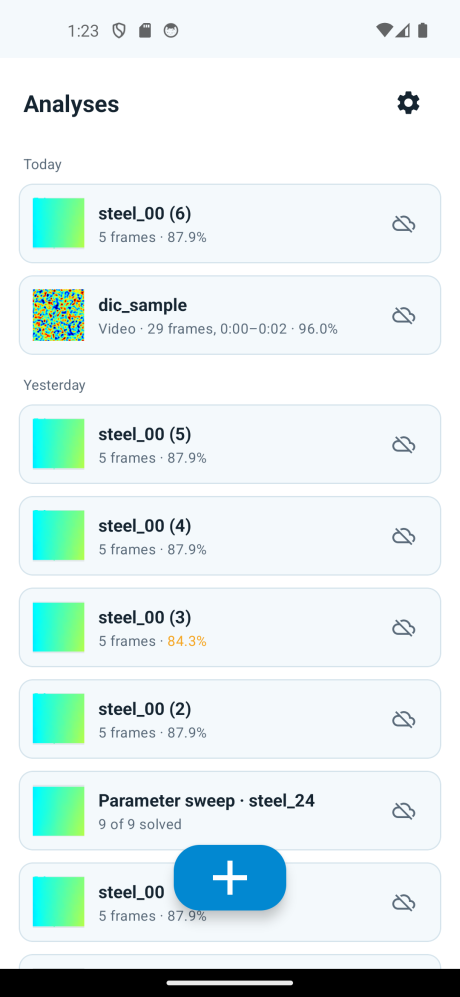
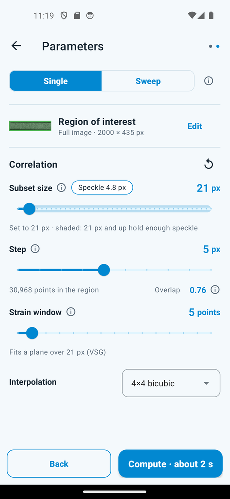
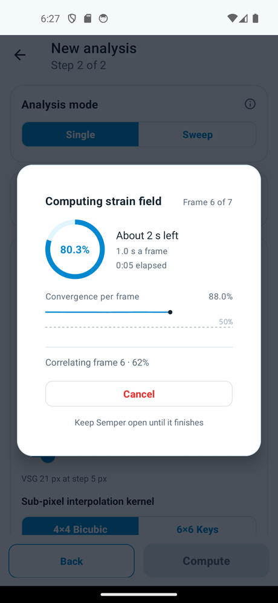
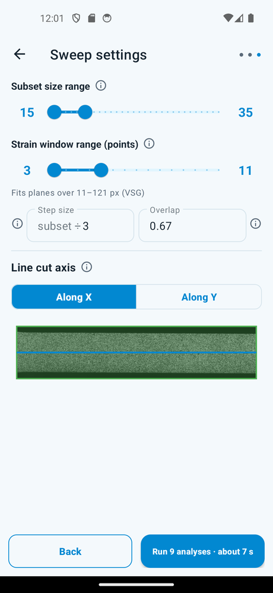
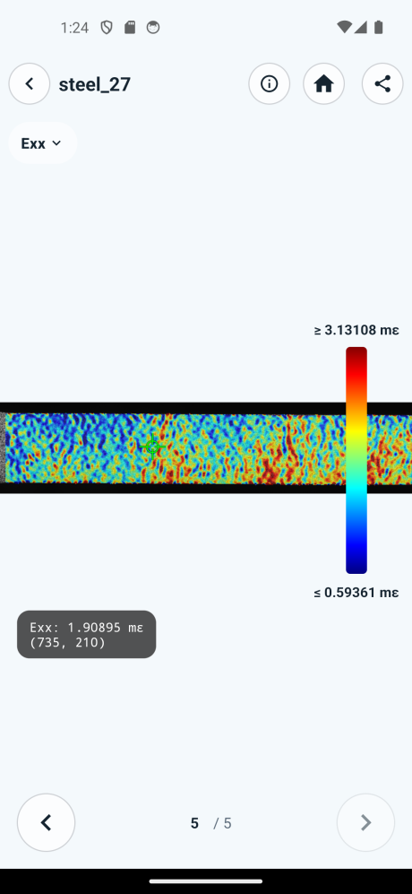
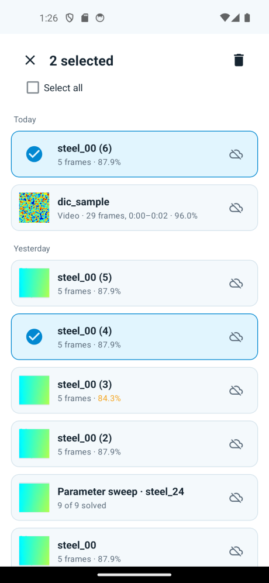

# Semper operating manual

How to get displacement and strain fields out of a DIC image set, using the app.

Lighting, rig stability, and the measurement floor — why they dominate strain
noise on a static check — are covered in
[app/NOISE_FLOOR_STRAIN_ACCURACY.md](app/NOISE_FLOOR_STRAIN_ACCURACY.md). For
broader DIC practice (speckle paint, cameras, calibration), see *A Good
Practices Guide for Digital Image Correlation* (iDICs). This manual starts once
you have images.

<!-- **For:** a graduate researcher who knows DIC basics — subsets, correlation,
strain fields — and has not used this app. -->

| | |
|---|---|
| [1. What it does](#1-what-it-does) | [7. Parameter sweeps](#7-parameter-sweeps) |
| [2. Getting in](#2-getting-in) | [8. Reading results](#8-reading-results) |
| [3. Images it accepts](#3-images-it-accepts) | [9. Exports](#9-exports) |
| [4. Running an analysis](#4-running-an-analysis) | [10. Managing analyses](#10-managing-analyses) |
| [5. Parameters](#5-parameters) | [11. Troubleshooting](#11-troubleshooting) |
| [6. Region of interest](#6-region-of-interest) | |

---

> **`delete-dialog.png` below still shows the pre-2026-08 UI** — recapturing it
> needs a signed-in account with a cloud-backed analysis. `home.png`,
> `step2-parameters.png` and `speckle-warning.png` were recaptured on 2026-09-09
> after the in-app camera was removed, so they show the current **+** button and
> the speckle readout — but `home.png` is now an empty-state shot, so the list
> rows and the cloud sync badges are not visible on it; those and the Settings
> **Download** row still need a real-account pass. `settings.png` shows the
> current UI but only its local-only state. Every other screenshot on this page
> matches the current UI. The diagrams
> (`pipeline.svg`, `wizard.svg`, `subset-step.svg`, `vsg.svg`, `lattice.svg`) are
> conceptual, not screen captures, and are current. Remaining work:
> [images/CAPTURE_CHECKLIST.md](images/CAPTURE_CHECKLIST.md).

## 1. What it does

You give it one reference frame and N deformed frames. It matches subsets on a
grid and returns five fields per frame.


| Field | Unit |
|---|---|
| **U**, **V** — displacement | px |
| **Exx**, **Eyy**, **Exy** — strain | mε (millistrain) |

Two things to know up front:

- **Displacements are in pixels.** There is no scale calibration. Convert to
  physical units yourself.
- **Everything runs on the phone.** Cloud backup stores results only.

---

## 2. Getting in

Accounts need approval, not just sign-up.

1. Sign in with Google or email.
2. **Passwords** need 8+ characters with upper and lower case, a digit and a
   special character. **Generate secure password** fills a strong one in for you
   and reveals it so you can save it. **Forgot password** mails you a link;
   opening it on this device reopens the app on a set-new-password form, where
   the same rules apply. You never leave the app to reset a password.
3. **Signing up with email?** Creating the account sends a verification link and
   puts you back on the sign-in form with your address still filled in. Open the
   link, then sign in there. Until you do, sign-in is refused and a fresh link is
   sent each time you try.
4. New accounts land on **Pending approval**. Support is emailed automatically
   at this point — you do not have to ask to be noticed.
5. Tap **Request access** if you want to add context. It opens a prefilled
   email; send it.
6. After an admin approves you, tap **Check status**.

**Nothing polls.** The screen never updates on its own. Use the button.

Google and email-link sign-ins skip step 2 — both already prove the address.

Offline works if you have been approved on this device before. Import, solve and
read results all work without a network. Uploads wait.

**Crash reports are opt-in.** After the beta notice on first run the app asks
once whether it may send crash diagnostics. Nothing is collected unless you say
yes, and you can change your mind at any time under **Settings → Your data →
Send crash reports**.



Home lists your analyses. Tap one to open it. Long-press for select, rename,
delete. Pull down to sync. **+** goes straight to the picker — pick existing
photos or a video. There is no in-app camera; the app measures images you
already have. (The shot above is the empty state, before any analysis exists.)

---

## 3. Images it accepts

Hard rules:

| Rule | If broken |
|---|---|
| All frames the same pixel size as the reference | Blocking error; you cannot run |
| At least one reference + one deformed frame | **Next** stays off |
| At most *Max frames* (default 50) | Extras dropped, with a toast |

**Formats.** PNG and TIFF are best. JPEG works but raises an accuracy warning —
compression damages the intensity gradients correlation needs. RAW and DNG
import **only through Files**, not Photos.

**Texture check.** On import the app measures your speckle. Weak pattern → a
warning naming a bigger subset size. Treat it as a comment on the pattern, not
just a setting.

**Video.** Pick a video and a sampling sheet opens: frame rate, time segment,
live frame-count estimate. Frame 0 becomes the reference.

---

## 4. Running an analysis


### Step 1 — Load frames


Tap each dropzone and pick your images:


The **New analysis** sheet opens full height on an **Images** tab — your device's
gallery, three columns, with videos badged so you can tell them apart. For about
1 second the grid is dimmed behind a large centred hint so you read "Select
the reference image" before tiles unlock. Tapping the **Files** tab hands you to the
system file browser instead; that is still the only route to RAW and DNG. Picking
deformed frames is multi-select: tap the tiles you want and confirm with
**Use N**. Select-all lives in the three-dot menu.

The sheet asks for media permission the first time the Images tab needs it:


The Files tab needs no permission at all, so a phone that denies gallery access
can still work entirely through Files — it opens the system file browser:


The strip shows the deformed frames with order badges.

**The app measures your speckle as soon as the reference loads.** It
autocorrelates a window of the reference and reports the average speckle
diameter. If that falls outside the 3–9 px band the iDICs Good Practices Guide
asks for, a warning chip appears under the dropzones saying what it measured and
what it means:


The chip is advice, not a block — the run proceeds either way. Under 3 px the
pattern is finer than the method can resolve and no subset size fixes it; over
9 px it will correlate, but a finer pattern would give more measurement points
across the same area. Either way the fix is a different photograph, which is
why the chip sits here with the images.

A separate chip appears **on step 2, under the subset slider**, when the speckle
is inside the band but the subset is too small to span three of them. It names
the subset that would, and it clears as you move the slider past it — the
control and the warning are on the same screen on purpose:


**The badge order is the analysis order.** Frame 1 here is frame 1 everywhere
after. Tap the sort icon to change it:


| Sort | Use when |
|---|---|
| Name · A–Z / Z–A | Filenames carry the sequence |
| Date · oldest / newest first | Filenames don't; uses capture time, then EXIF |
| Manual | Neither works — drag the thumbnails |

You cannot get back to the picker's original order once sorted. With one
deformed frame the control is hidden.

### Step 2 — Settings



Three decisions, in this order:

- **Single setting** or **Parameter sweep** — Single solves every frame once. A
  parameter sweep solves one frame many times ([§7](#7-parameter-sweeps)).
- **Region of interest** — defaults to the full image. **Edit** opens the editor
  ([§6](#6-region-of-interest)).
- **Parameters** — in Single, the advanced set ([§5](#5-parameters)). In Sweep,
  the subset range, strain-window range, and step as subset ÷ N (default 3),
  with overlap shown at the end of that row.
  If you copied a set of parameters from a sweep lattice, a **Paste params**
  chip appears in Single and fills subset, step and strain window in one tap.

Then **Compute** (Single) or **Next: Summary →** (Sweep).

### While it runs



**# converged** and **convergence** update live. **Cancel** stops the run
where it is, within a moment — it does not wait out the frame being solved.
Nothing is kept. Back is blocked. Cancelling a parameter sweep abandons the whole
sweep, not just the combination in flight.

The same overlay covers importing frames and extracting video, but there it
counts frames instead: the two compute tiles are hidden, because nothing is being
solved yet. Cancelling an import asks for confirmation and leaves nothing behind.

**A run stops itself if the images decorrelate.** Two consecutive frames below
50% convergence end it — the frames after them would be no better, and the
message names the frame and image it gave up on.

This is a **short run, not a failed one**: the frames solved before the collapse
are real data, they are saved as an analysis, and acknowledging the message takes
you straight into them. A 50-frame test that decorrelated at frame 40 still gives
you frames 1–39.

**The reason is kept with the analysis.** Its Home row reads "39 of 50 frames"
followed by why it stopped, and **Settings used** (the ⓘ in the viewer) lists
*Stopped early* and *Frames solved*. You do not have to remember the run — or
have been the person who made it.

**Keep the app open.** A run has no resume. If Android kills the app, the run is
gone.

### After

| Result | You land on |
|---|---|
| Single setting | Result viewer, frame 1 |
| Parameter sweep | Result lattice |
| Some sweep points failed | `N of M skipped` toast, then the lattice |
| Engine failed | A dialog naming the cause, and which frame and image it failed on |
| Every sweep combination failed | The lattice, every node hollow — tap one for its reason. **View** and **Save graph** are disabled |

Re-running the same inputs updates the same analysis. Different inputs make a
new one, which counts towards your quota. Picking the reference again counts as
different inputs, even when it is the same image, and so does importing the
frames again.

---

## 5. Parameters

Single mode only. Slider or typed field, each with an ⓘ. Step and overlap
share a title row; the overlap ratio sits beside the step readout.

| Parameter | Range | Reset to |
|---|---|---|
| Subset size | 15–121, odd | Recommended |
| Step size | 1–`min(30, subset/2)` | 5 |
| Subset overlap | 0.50–0.99 (`1 − step / subset`) | Follows step |
| Strain window | 3–31 points, odd | 5 |
| Kernel | 4×4 Bicubic / 6×6 Keys | 4×4 Bicubic |

### Subset and step


The app recommends a subset from **your** reference image, using the SSSIG model
of Pan et al. (Opt. Express 16(10), 2008): displacement error scales as
1/√SSSIG, so it grows the subset until the gradient content clears the threshold
for 0.007 px accuracy, sampled on a 4×4 grid and taken as the median.

It is a starting point. Touch the slider and it stops tracking the image.
**Reset** brings it back.

A muted line under the subset slider reads **"Speckle measures about N px
across. Good practice asks for 3–9 px."** — the same measurement as the step 1
chip, kept in front of you while you move the slider. It updates as the
reference changes and disappears if the reference is removed. Below it, a
warning chip appears if the subset you are on cannot span three speckles, and
names the size that would; it clears as soon as the slider passes that size.

On a pattern coarser than about 40 px no allowed subset spans three dots, so no
size is named — the over-resolved chip on step 1 is the honest answer there, and
raising the slider to its maximum would not fix it.

**Subset overlap** is how much neighbouring windows cover each other after a
step: `overlap = 1 − step / subset`. The two controls stay in sync. The iDICs
Good Practices Guide keeps overlap at least 0.5 and strictly below 1.0;
typical values are about 0.50–0.75.

### Strain window and VSG

The strain window is a count of data points. The line under the slider shows the
VSG it gives at the current step, and follows as you change either. Sessions from
before the window was counted in points show their VSG alone.


```
VSG = (strain window − 1) × step + 1     [px]
```

Quote the VSG, not the window: it is the distance one strain value actually
covers. The sweep varies the **window** and reports the resulting VSG per node —
the window is the knob, the VSG is the number you publish.

### Kernel

Sub-pixel interpolation. Leave it on 4×4 Bicubic unless interpolation bias is
your subject.

### Max frames

In Settings, not here. 10–500, default 50. Caps frames per analysis.

---

## 6. Region of interest


**Draw** — pick Rect or Square, drag on the image. Drag inside to move, corners
to resize. The HUD gives size and position live.

**Zoom** — pinch to zoom (up to 10×) and pan with two fingers; double-tap for
2× and back to fit. One finger always draws, so edges can be placed finer zoomed in.

**Manual** — type X, Y, W, H and Apply.

**Crop / Erase** — Crop sets the area to correlate. Erase punches holes in it,
for grips, fiducials or anything that will decorrelate. Add as many as you need.

| Button | Does |
|---|---|
| **Save ROI** | Keeps it, returns to step 2 |
| **Use full image** | Saves the whole frame |
| **Reset** | Clears the canvas |
| **Cancel** | Discards — back to full image |

An ROI smaller than the subset will not run.

---

## 7. Parameter sweeps

### Why

Strain is a derivative, so its size depends on how much you smooth. Small VSG:
peak strain rises, noise rises. Large VSG: peak gets flattened. A sweep shows
where your answer stops depending on the setting — the convergence argument the
Good Practices Guide asks for (Tip 5.4).

A sweep uses **one** deformed frame.

### Setting it up (step 2, then step 3)

Sweep parameters live on step 2. Step 3 is the summary: planned lattice, then
the line cut, then **Compute**.



| Control | Range |
|---|---|
| Subset range | 15–121, odd (step 2) |
| Strain window range | 3–31 points, odd, default 3–11 — min and max (step 2) |
| Step size | subset ÷ N, N 2–9, default 3. Overlap on the same row is `1 − 1/N`. Pixel step is `round(subset / N)` (step 2) |
| Frame to sweep | radio list + number + preview (step 2) |
| Samples | 1–8 per axis (step 3, lattice gear) |

Runtime is the product of the two sample counts. 8 × 8 is 64 solves. Start at
3 × 3.

The sweep varies the **strain window** directly, not the VSG. VSG is still what
you quote — it is shown per node and in the settings sheet — but it is derived
(`(window − 1) × step + 1`), so two combinations with different steps can share a
window and land on different VSGs. The lattice plots each node at its VSG, so one
window sits higher at a larger subset's step.

The lattice preview on this step is **inert** — taps do nothing until it has
run. The coach mark points it out on a first visit.

### Reading the result lattice


| | |
|---|---|
| Filled dot | Solved. All solved nodes share one colour; the focused one gains a ring |
| Hollow red ring | Skipped — tap it and the reason names the combination and what went wrong |

Colour on the plot below is reserved for the focused curve, so only one hue
ever carries meaning at a time.

The screen is built to be worked with one thumb. It scrolls — summary line,
lattice, controls, then plot — while **Save graph** and **View** stay pinned at
the bottom. The y axis is the **VSG (px)**; the lattice draws compact, so
the coach mark on first visit is what names the axes.

**Choosing a combination**

- **Tap** a node, or use the **‹ · ›** stepper above the plot to walk the solved
  nodes in order. The chip between the arrows names the current one.
- **Double-tap** or **long-press** a node — opens that result. So does **View**.
- Tapping a hollow node explains why that combination was skipped.

**Reading the plot**

- The **All / Node** pill above the plot chooses how much is drawn. **All** is
  the default: every combination, the focused one at full strength in colour and
  the rest sharing one muted neutral. **Node** narrows it to the focused
  combination alone.
- **Drag across the plot** — a guide follows your finger, a dot marks the curve
  and the value is printed beside it. The **slider** under the plot does the same
  thing and stays in sync with the drag, which is easier one-handed.
- The readout under the plot shows `x=…  y=…` for one unmuted curve, or `x=…`
  plus each `label=value` when **All** is showing several series.
- **Pinch to zoom**, **two-finger drag** to pan, **double-tap** to reset. The
  zoom survives stepping to another node; changing component resets it, because
  Exx, Eyy and Exy differ in magnitude.
- The **Exx / Eyy / Exy** selector switches component.

**Taking the answer with you**

- **Double-tap or long-press the parameter chip** to copy that combination's
  subset, step and strain window. Start a new single-setting analysis and a **Paste params** chip on
  step 2 fills them in — this is how you go from "the sweep says 41 · 5 · 15" to
  running the whole batch at it.
- **Save graph** writes a PNG and hands it straight to the system share sheet —
  it is the one export that does not go through **Send to**. The file carries a
  header naming the study, the reference image and deformed count, and the
  focused combination's parameters (plus the combination count when the plot is
  showing **All**); the plot; and a single-column colour legend. It is rendered fit-to-data, so your
  on-screen zoom neither leaks into the file nor is disturbed by saving.

Look for the VSG where the curves stop separating.

---

## 8. Reading results



Field pills switch field. Pinch to zoom (~10×), drag to pan; both survive a
field change. Double-tap zooms or resets. A horizontal fling while fit-to-screen
steps frames. Chrome auto-hides after a short idle; pan or scrub brings it back,
and so does a tap in the middle of the screen or a downward swipe. The figure
itself runs edge to edge, under the system bars. The ⓘ sheet holds the specimen
name, max / min (with coordinates), mean, a histogram of this frame's accepted
values, and the settings used for this analysis. The looping summary has no
mean and no histogram — its ⓘ sheet quotes only the GIF colour-bar ends.

**Colour scale.** Default on a **single frame** is a **clamp at this frame's 2nd and 98th percentiles**,
which is why the hairline reads "≤" and "≥" rather than "Min"/"Max" — a handful of
outliers must not flatten the whole map. On a single frame the ⓘ sheet still
gives you the true extrema, and the two are allowed to disagree. While the
summary animation is up, the colour bar and ⓘ both quote the **lowest scale-min
and highest scale-max across every frame** — those two ends need not come from
the same frame. Tap the bar to set fixed min/max
(remembered per field). **Auto scale** drops a custom override and returns to the
clamped bounds on a frame, or to that sequence envelope on the summary. On a single-setting analysis the
summary GIF and share field GIFs still use a whole-sequence scale so the
loop stays comparable.

**Tap to probe.** There is no Inspect / X,Y / Max-Min row. A short tap on the
heatmap — including the centre — places a crosshair and a plain-text reading at
the nearest correlated point. The bars hide on an idle timer, not from a tap;
a centre double-tap brings them back when they have faded. Drag past the touch
slop pans (or flings to the next frame when unzoomed); pinch still zooms. Tap
the readout chip to dismiss. Switching field or frame keeps the probe at the
same image location and updates the value.

**The summary comes first** on a single-setting analysis. The viewer opens on a
looping field overview of the whole sequence — every frame, never longer than
10 seconds, about 300 ms a frame until the frame count forces it faster. It is
framed on the same coloured region the live view rest-fits to (your ROI, or the
accepted points), scaled to fill — not a letterboxed full photo. While it builds
you get a progress readout and a **Cancel**. **Next** enters the
frames; **Prev** on frame 1 comes back to it. Switching field rebuilds it in that
field. Field pills stay available while it plays. A parameter sweep opens from
the lattice onto one combination instead; there is no overview slot.

(Playback needs Android 9 or newer. Below that you get the first frame
and a note; single-setting field GIFs still export.)

**Frames.** Prev / Next step through; the counter shows the filename and
`(i / N)`. Type a number in the small field under it and press Go to jump
straight to that frame — useful at 150 frames. Anything out of range leaves you
where you are. On a sweep each frame is a parameter combination, labelled like
`S15 · St5 · W13 · VSG 61`.

### Settings used


The ⓘ button. On a still frame: true min, max and mean, then a histogram of
every accepted point (including values the colour bar has clamped away). Tap a
bar for that bin's range and count. On the summary GIF the histogram is omitted.
Then everything the result was computed with — and on a sweep, the
line-cut plot. The strain-window row gives both numbers, e.g. "13-point window ·
VSG 61 px", `(13 − 1) × 5 + 1` (the relation is in [§5](#5-parameters)). A session
from before the window was counted in points shows "VSG 15 px" alone. A run that stopped early also
carries **Stopped early** and **Frames solved** here.

**Changing settings later never changes an old result.** This sheet is your
provenance record.

---

## 9. Exports

**Share** gives six targets. Each ends at a **Send to** sheet with two rows:
**Save to Files** (a folder picker, so it lands somewhere you choose and stays) or
**Share** (the usual system chooser). For everything but the single photo the
sheet comes up **first**, so the file is written straight into the folder you
picked instead of being staged and handed over. Exports are named after the
analysis, so a folder of them is still readable a month later. A long export does
not hold the screen: dismiss the progress dialog and it carries on behind a strip
at the top, with its own progress and a Cancel.

| Export | Contents |
|---|---|
| Single Field | One PNG: current field and frame, annotated, composited to a 1280 px long edge |
| All fields | Five PNGs for this frame, zipped; the sheet and each stamp name the source image |
| Animations | Single-setting only: five looping field GIFs on one whole-sequence scale, zipped |
| PDF report | Every frame, plus a telemetry page |
| CSV data | `image,x_px,y_px,u_px,v_px,exx,eyy,exy,znssd` — a sweep adds `subset_px, step_px, strain_window, vsg_px` |
| Everything (.zip) | Raw photos + all fields + CSV + PDF; single-setting also includes the field GIFs |

On a single-setting analysis the field GIFs are shared as a set, not one at a
time — they are only comparable because they share a scale, and the set is what
carries that.

Build on the **CSV**. Coordinates are image pixels, displacements pixels,
strains scientific notation. `znssd` is the match residual — filter on it to drop
badly correlated points. Number formatting is locale-independent.

For a paper, export **Everything** and keep it with your raw images. Inputs,
fields and parameters in one archive is what makes the result reproducible.

---

## 10. Managing analyses

Long-press a row to select. Pencil renames (one row only), bin deletes. When
every selected row is **Only in cloud**, a cloud-download button restores them
all at once; each row shows its own progress.

**Backups that are not on this phone.** On a new phone, or after a reinstall,
Home shows a card above the list — "4 analyses in your cloud backup aren't on
this phone." **Restore** lists them, all ticked; untick any you don't want and
they restore in the background. **Hide** puts the card away until the account
gets a backup this phone has not seen; hidden backups stay in the cloud and
Settings → Analyses data management can still restore them. Demo accounts have
no cloud backup, so they never see the card.



**What delete does depends on whether there is a cloud copy.** With none, it
goes from the phone and that is that:


With a backup you are asked *where* instead — **Delete from this phone**,
keeping the backup, **Delete the cloud backup**, keeping the phone's copy, or
**Delete everywhere**. Read that dialog before tapping.

**Deleting on this device only is not losing it.** The row stays on Home, badged
**Only in cloud**, and tapping it offers to **Restore** the analysis to the phone.
It restores in the background, and you stay on Home. That is the point of the badge: a cloud-backed analysis is one tap
from being local again, so freeing space is a reversible decision.


**Cloud backup**: turn it on and it offers to back up what is already
local. **Wi-Fi only** holds uploads until Wi-Fi. **Analyses data management**
lists local and cloud together, with three actions per row:

| Action | Does | Shows when |
|---|---|---|
| **Download** | Saves a `Session.zip` to a folder you pick — you choose the destination *before* it starts, and the bytes go straight there | Any row with a cloud copy, including ones already on the phone |
| **Restore** | Pulls the analysis back into the app so it opens normally | Only when the local frames are missing |
| **Delete** | Removes the backup, with a **5-second Undo** | Any row with a backup |

Downloads and restores keep running if you leave Settings, and report back when
they land.

**Storage** is the section to reach for when the phone fills up. It measures what
the analyses and the cache actually occupy, and gives you three tools:

| Control | Does |
|---|---|
| **Free up space** | Drops the local frames of analyses that are already backed up. They become "Only in cloud" rows; nothing un-backed-up is touched |
| **Clear cache** | Removes regenerable files — previews, exports waiting to be shared |
| **Auto-free budget** | A slider, 0 (off) to 64 GB. Set it and the app reclaims space at start-up whenever usage is over the budget, oldest backed-up analyses first |

**Background transfers survive leaving the screen and are honest about failure.**
An upload or restore runs even if you navigate away, showing a system
notification while it works, and — while you are on Home — a progress bar on the
row itself, for downloads as well as uploads. Success is quiet: the badge or list
just updates. A backup that *fails for good* (another device holds the account,
the analysis is too large, or a render ran out of memory) raises a dialog on the
Home badge explaining why, with **Try again**. A restore that fails (the backup
was deleted, or is not this account's) says so once, on whichever of Home or
Settings you are on. You are no longer left guessing.

**Your data** also holds **Send crash reports**. That one switch governs both
crash diagnostics and anonymous product analytics — which screens and actions get
used, in coarse buckets. Neither carries your images, results, specimen names or
addresses, and nothing is sent until you turn it on.

**Your data** holds the two exports and the account delete. **Export my data**
builds a ZIP of everything on this phone; **Download my cloud account data** asks
the server for its copy. Both show progress and finish at the same **Send to**
sheet as any other export.

**Deleting your account** (Settings → Your data) asks you to confirm your
identity first, on the sign-in screen itself — whichever way you normally sign
in: password, Google, or an emailed link. Your address is filled in and cannot be
changed; you are proving *this* account. Back out and nothing happens. Once
confirmed it erases the cloud copy, this device, and the sign-in itself, and
signs you out. If the cloud cannot be reached nothing is deleted at all. A
licence goes back first: an institution seat is freed for someone else, and an
individual licence is released and re-offered to the same address, so signing
up again with it is licensed straight away.

**Quota.** The Home chip reads `Using N of M analyses` and turns red at the cap.
Only a run that makes a new analysis is checked against it: a re-run of the
same inputs is not, but one after picking a new reference or new frames is.
Not a paywall — email support from the limit screen, or delete something and
tap **Re-check**.

**Help & support** is the last section, and it now opens the **Manual** directly
as well. **Send feedback** is for "this could be better" — it opens a mail with
your app version and phone model and nothing else. Prefer the
[Manual](https://sempermechanics.com/manual/) for how-to. Report bugs and
request features from **Settings → Help & support** (opens the Support page).
The section also shows
`support@sempermechanics.com` — selectable, so you can copy it if this device has no
mail app — and **Email support**, which opens a mail already carrying your
account, device ID, app version and phone model for private or account issues.
Write above that block; leave it in place.

---

## 11. Troubleshooting

| Symptom | Cause |
|---|---|
| Run blocked, size message | A frame differs in pixel size from the reference |
| **Next** off on step 1 | Missing the reference or all deformed frames |
| "ROI too small" | ROI smaller than the subset — enlarge it or shrink the subset |
| Engine failure: feature detection | The pair could not be correlated. Pattern, or wrong pair |
| Engine failure: ROI | Region too small or fully masked |
| Low-texture warning | Weak speckle for this region |
| Sweep skipped nodes | Those combinations don't fit — usually big subsets in a small ROI. Tap a hollow node for its reason |
| Run stopped itself partway | Convergence fell below 50% twice running — the pair has decorrelated. The message names the frame, and the frames before it are kept |
| Sweep ended early | Same rule: two combinations under 50% and it stops rather than sweep the rest |
| Password rejected on sign-up | 8+ chars, upper and lower case, a digit and a special character — or tap **Generate secure password** |
| Only the first N frames | *Max frames* capped it |
| Frames in the wrong order | Sort on step 1, then re-run |
| Run vanished | The app was killed. No resume — run it again in the foreground |
| Frames look incomparable | Auto colour scale. Fix the bounds, or on a single-setting run use the summary overview — it already puts them on one |
| Summary still says "Rendering" | A long analysis takes a while to render five fields; the frames are usable meanwhile |
| Summary shows one frame, not a loop | Android 8 or older. Single-setting field GIFs still export |
| Delete account opens the sign-in screen | Expected — that is where your identity is confirmed |
| Badge stuck on Pending | Offline, Wi-Fi-only, or backup off |
| Badge shows Failed | Tap it — the dialog names why (device conflict, too large, ran out of memory) and offers **Try again** |
| Restore never arrived | If it failed for good, Home and Settings both show a message saying so; otherwise it retries on a flaky network |
| Row says "Only in cloud" | Its local frames were freed (by you, or by the auto-free budget). Tap it and choose **Restore** |
| Phone out of space | **Settings → Storage → Free up space**, and consider setting an auto-free budget |
| Still pending approval | Tap **Check status** — it never polls |
| Sign-in refused after signing up | Open the verification link in your email, then try again |
| Nothing here matches | **Settings → Help & support** — [Support](https://sempermechanics.com/support/) or **Email support** (the mail carries your account, device and build) |

---

<!-- ## 12. Limits

- An interrupted run is lost. No resume.
- Background transfers notify while they run, but nothing tells you they finished.
- No spatial calibration — pixels only.
- Coach marks show once and cannot be replayed.
- Approval never polls.
- No open-source licences screen (Privacy Policy and Terms are linked from About).
- ROI shapes are rectangle and square only. -->

---

## Appendix A — Parameters

| Parameter | Range | Default | Raise when | Lower when |
|---|---|---|---|---|
| Subset | 15–121, odd | Recommended | Speckle is weak; correlation fails | You need resolution across a sharp gradient |
| Step | 1–30 | 5 | Runtime matters | You need a denser field |
| Strain window | 3–31 points, odd | 5 | Strain is noisy | Detail is being smoothed away |
| Kernel | 4×4 / 6×6 | 4×4 Bicubic | Studying interpolation bias | — |
| Max frames | 10–500 | 50 | Long sequences | Runs are killed for memory |
| Sweep subset range | 15–121, odd | Around recommended | — | — |
| Sweep strain window range | 3–31 points, odd | 3–11 | Strain is noisy | Detail is being smoothed away |
| Step denominator | 2–9 | — | Denser correlation | Faster runs |
| Samples | 1–8 per axis | 3 | Finer detail | Runtime is the product |

`VSG = (strain window − 1) × step + 1` (px; window in points)

## Appendix B — Glossary

| Term | Meaning here |
|---|---|
| Reference | The undeformed frame everything is matched against |
| Deformed frame | One load step |
| Subset | The pixel window matched at each point |
| Step | Spacing between grid points |
| Strain window | A count of data points (odd): strain is a plane fitted to every point within (window − 1) / 2 steps |
| VSG | Virtual strain gauge — what one strain value covers, `(window − 1) × step + 1` px |
| ROI | Region of interest, optionally with erased holes |
| SSSIG | Sum of squared subset intensity gradients — drives the subset recommendation |
| ZNSSD | Correlation residual, one per point, in the CSV |
| mε | Millistrain |
| Parameter sweep | One frame solved across a lattice of subset × VSG |

## Appendix C — Administrators

Admin accounts get **Settings → Account → Pending access requests**: everyone
waiting, with **Approve** and **Deny**. Approved users get in when they next tap
**Check status** — they are not notified, so tell them.

You do not have to watch that list. The backend emails `support@sempermechanics.com`
the moment an account is created pending, naming the account and its user id,
with both ways to approve it. One mail per account, at creation — approving,
denying or signing in again sends nothing further. If no mail arrives, check the
`NOTIFY_FROM` / `RESEND_API_KEY` settings on the service: unconfigured, the
backend sends nothing and says nothing, and the pending list is your only signal.

## Appendix D — Licensing (demo / individual / institution)

Every account is **Demo** (25 saved analyses, no share, no backup/restore
*feature*) until a licensed key is activated. A demo account's analyses are
still **recorded** — images and results upload and are stored exactly as a
licensed account's are — but the app shows demo no sync badge, banner or
Settings backup section, and the backend refuses demo retrieval (`/content`,
bundle → `feature_not_licensed`). Recording is open so that installed builds
predating licensing keep backing up after the backend deploy; a licence turns
retrieval on with nothing to re-upload. There is no billing anywhere in
the product — a licensed key is issued by Semper staff or, for an
institution, self-served by that institution's own IT once Semper staff mint
the institution key. There is **no in-app screen to type a key in yet** in this
release; activation goes through the backend API
(`POST /v1/licenses/activate`) directly. See
[CLOUD_ARCHITECTURE_GCP.md §20](backend/CLOUD_ARCHITECTURE_GCP.md#20-licensing--entitlements)
for the full design; this appendix is the day-to-day operator/support version.

**Minting a key** (Semper staff, device-attested — same admin device that
approves/revokes accounts):

- **Individual**: `POST /v1/admin/licenses` with an `emailLock`. Minting also
  records a pending invite against that address, and **that is the delivery**:
  the customer signs in with it and the licence attaches on their first
  request. If that address **already has an approved, verified account** — a
  demo user, or an account from before licensing — the licence attaches
  immediately at mint time instead; the response carries `claimedByUid`, and
  the system demo key is dropped. It binds to the first device they sign in
  on, and stays on that device.
- **One licence per person.** An address that already holds or is promised a
  live licence — its own, an institution seat, or a pending invite — is
  refused with `409 email_already_licensed: <licence id>`, and the desk shows
  that licence. To renew, use Edit on it; to replace it, revoke it first, then
  mint. A revoked licence, one past its grace, and the Demo key do not count.
  The same rule refuses a key typed in the app (`409 already_licensed`) and an
  IT roster add (`409 member_already_licensed`). To change the person's
  device, use **New device** on their licence — never a second licence.
  `backend/scripts/find_duplicate_licences.py --project <id>` lists anyone
  who got two before the rule existed. Nothing is sent to them and nothing is typed. `deviceIdLock` is
  still accepted for the rare case where the device is known up front, but
  normal issuing leaves it empty.
- **Institution**: `POST /v1/admin/licenses` with `kind: "institution"`, a
  `domainLock` (the institution's email domain), the `adminEmails` of the
  people at that institution who will manage seats, and an optional
  `maxSeats`. Anyone at that institution with a **verified** email on the
  domain can then activate the same key and claim a seat, up to `maxSeats`.

**Perpetual or timed.** Either kind of key is one or the other, set by
`duration` at mint:

- `duration: "perpetual"` (the default) — never expires. Do **not** send
  `expiresAt`; the request is rejected if you do, so a perpetual key cannot
  silently acquire an expiry.
- `duration: "timed"` — requires a future `expiresAt`. Add `graceDays` to say
  how long it keeps working past that date (omitted uses the fleet default of
  14; `0` is a hard cliff).

`supportUntil` may be set on either and is recorded for support's benefit
only — it never stops anyone using the product.

**What grace means.** During grace the account keeps *everything*: cloud
backup, share, the licensed analysis ceiling. The user sees a notice on Home
saying a renewal is overdue, and nothing else changes. It exists so a renewal
being processed does not interrupt someone mid-project. Entitlement stops at
`expiresAt + graceDays`, at which point the account drops to Demo — which, as
always, never deletes anything.

**Renewing a key** (Semper staff, device-attested):

```
PATCH /v1/admin/licenses/{licenseId}
{"expiresAt": "2027-06-01T00:00:00Z", "graceDays": 30}
```

This extends the key **in place**. Everyone already on it — the individual
holder, or every non-revoked institution seat — is re-entitled without issuing
a new key or asking anyone to re-activate. Send only the fields that change;
`maxSeats`, `maxAnalyses`, `supportUntil` and `note` can be edited the same
way. A `maxSeats` below the members already on an assigned institution roster
is refused (`422 max_seats_below_used`) — it would remove nobody and only make
the count read "12 of 10"; remove members first. A floating licence's pool may
be smaller than its roster. On the desk every one of these is the row's
**Edit** dialog, which sends only what changed.

**Upgrades and downgrades in place.** On an institution licence, `seating`
switches between assigned and floating (floating needs `maxSeats`; assigned
needs `maxSeats` to cover the roster, and clears every lease), and
`adminEmails` replaces the IT contacts. `perpetual: true` removes the end
date. What you cannot change is who the key is *for*: `kind` and the
email/device/domain locks are fixed at mint — except **To institution**
(`POST /v1/admin/licenses/{licenseId}/convert` with `domainLock`,
`adminEmails`, `maxSeats`, `seating`): a new institution key carrying the
individual licence's terms, the holder moved onto its roster on the same
device, and the individual licence revoked and marked replaced. The holder's
address must be on the domain. The new key is shown once.

A new `expiresAt` must normally be **later** than the one in force. The
request is refused with `422` and nothing changes if the date has already
passed (`expiry_in_past`), is earlier than the current expiry
(`expiry_before_current`), or the key is perpetual (`license_perpetual`). A
**downgrade** agreed with the customer — an earlier end, or an end on a
perpetual key — is sent with `"allowShorten": true`; the desk asks for the key
to be typed first. A past date is refused even then: to end a key now, revoke
it. The operator desk reports the expiry the server stored.

**`maxAnalyses` is per person, not per licence**, and is normally left empty:
empty gives every holder the licensed default (`LICENSED_MAX_SESSIONS_PER_USER`,
999). On the operator desk it is "Cloud analyses per person", and the table's
"Analyses / person" column shows it. A value below the demo allowance
(`DEMO_MAX_ANALYSES`, 25) is refused, and the backend floors any older one at
that allowance. To remove a cap, empty "Cloud analyses per person" in the
row's **Edit** dialog, or:

```
PATCH /v1/admin/licenses/{licenseId}
{"clearMaxAnalyses": true}
```

**A demo key has no cap to set.** Every account gets a system-minted demo key
(`createdByUid: "system"`, `mode: "demo"`), and a demo holder gets the demo
allowance (`DEMO_MAX_ANALYSES`, 25) whatever the key stores
(`resolve_user_config` reads a licence cap only for a licensed account). A
`maxAnalyses` on a demo key is refused with `422 cap_on_demo_key` and nothing
changes. On the desk a demo row's **Edit** dialog has the field disabled and its
"Analyses / person" column reads "demo (25)". To give that person more
analyses, issue them a licensed key. `clearMaxAnalyses` is still accepted on a
demo key; use it to remove a cap stored before this refusal existed, which
never applied (SEMP-8AKN, set to 100 on 2026-09-25, is one).

Renewing is also the fix when someone reports being dropped to Demo
unexpectedly — check the key's `expiresAt` in `GET /v1/admin/licenses` first;
an account past `expiresAt + graceDays` is the expected outcome, not a bug.

**A key past its grace window will not activate.** `POST /v1/licenses/activate`
returns `403 license_expired` rather than appearing to succeed and leaving the
user on Demo. Renew it first, then have them activate. A key still *inside*
grace activates normally.

The plaintext key from an individual mint is shown once, in the mint response,
and Semper does not store it anywhere retrievable afterward (only its hash).
**Keep it; do not send it.** It exists for support recovery — re-attaching a
licence when the invite has been consumed but the account has lost it — not
for delivery. Institution keys are the same in reverse: membership is the
roster, so there is nothing to hand anyone.

**"I never got my licence."** Check `GET /v1/admin/licenses` for the address:
`status: "unused"` with an outstanding invite means it is waiting for them to
sign in, and the usual cause is that they signed in with a *different* address
than the one it was minted against — mint a new licence against the right one
and revoke the first. `status: "redeemed"` means it attached; if they are
still in Demo, the device lock is the next thing to check.

If minting reports the address is **already promised another licence**, the
new licence exists and its key still redeems it, but the invite belongs to the
earlier licence and the new one will not attach at sign-in. Revoke whichever
of the two is wrong, then mint the replacement: revoking withdraws that
licence's outstanding invites, which frees the address. Minting also recovers
by itself from an invite left behind by a licence that is already revoked or
deleted — such an invite promises nothing, since the claim discards it on
sight, so a fresh mint overwrites it.

**Assigned or floating seats.** An institution key is one or the other, set by
`seating` at mint:

- `seating: "assigned"` (the default) — every member of the roster is
  licensed, and `maxSeats` caps how many members there can be.
- `seating: "floating"` — every member is *eligible*, but `maxSeats` caps how
  many are licensed **at the same time**. The roster itself is uncapped, which
  is the point: fifty people in a lab can share ten seats. `maxSeats` is
  required for floating; an uncapped pool would never refuse anyone.

A floating member without a seat is in Demo, not blocked or removed. Their app
takes a seat when they start work and gives it back when they finish; a seat
also frees itself if their device goes quiet for 8 hours. If someone reports
being in Demo unexpectedly on a floating key, the pool being full is the first
thing to check — `GET .../seats` shows the roster, and the license summary
shows how many seats are in use.

**Adding people to an institution key.** IT adds members by email:

```
POST /v1/institutions/licenses/{licenseId}/seats
{"email": "student@university.edu"}
```

There is **no key for members to type**, and the person does **not** need an
account first. An address that already has one takes a seat immediately; an
address that does not becomes a pending invitation, redeemed by itself the
first time that person signs in. IT works from a list of addresses and cannot
make people sign up on cue, so the roster is built from the list you have.

The response says which of the two happened — exactly one of `seat` and
`invite` comes back — and the seats console labels an unclaimed place
*invited* rather than showing an error. An invitation holds no seat and counts
against nothing until it is claimed. On an assigned key a seat is licensed
immediately; on a floating one it makes the member eligible, and they take a
seat when they work.

The refusals worth recognising are `409 member_already_licensed` (that
person already holds, or is promised, a different live licence — one licence
per person; Semper staff move them), `409 invite_exists` (the address is
still invited to a different licence that has lapsed — withdraw that
invitation first) and `409 license_seats_exhausted` on an assigned key.
`503 claim_contended` is not a refusal: another request was claiming on the
same licence at that moment, and adding the member again succeeds.

An invitation to a full assigned key is not lost. The person signs in to Demo,
and within about 15 minutes of a seat freeing up their account claims it on
its own. The console counts pending invitations beside the seats taken.

**Hold and Resume** (`PATCH .../seats/{uid}` with `enabled`) work on a current
member only. A held seat keeps its place against the cap but gives up a
floating seat it was using. A removed member cannot be resumed (`409
seat_revoked`); add their address again instead, which takes a free seat.

**One address for everybody.** `sempermechanics.com/login` is the only web
address anyone needs — a customer, an IT contact, or Semper staff (it forwards
to `app.sempermechanics.com/login`, where the dashboards actually live). It signs
them in and forwards them to whichever dashboard is theirs: staff to the
operator console, an address named in a licence's `adminEmails` to that
roster, and everyone else to their own account page. Somebody who is both a
Semper operator and runs a licence gets a choice rather than a guess.

**Every user has an account page.** `/account` shows what the person holds —
mode, kind, key prefix, term, expiry and grace, whether they hold a floating
seat and until when — and how many analyses they have stored. From it they can
give a floating seat back, move their licence to a different device, and
download any stored analysis as one zip. The last two need a second factor;
the page offers to enrol an authenticator app if there is none. Point a
customer here before answering "am I licensed?" by hand.

**The seats console.** Institution IT can do all of the below from
`/console/institution` on the Semper auth site instead of curl — sign in with
the address named in `adminEmails`, paste the licence id, and the roster,
who currently holds a seat, and the add/hold/remove actions are all there. The
routes below are what it calls, and stay equally usable from a script.

Semper staff have `/console/operator`, which now does the whole job: issue an
individual or institution licence, extend a term, revoke a key, unbind a
licence or a seat from the device it is on, drive any institution's roster,
and approve accounts. It requires a **second factor** and
a sign-in from the last 15 minutes, because a browser cannot produce the device
attestation the phone path uses — the page walks you through enrolling an
authenticator app the first time. Revoking asks you to type the key prefix
before it will proceed. The phone admin screen still works exactly as before.

**Institution IT self-service.** Once an institution key exists, its `adminEmails`
manage seats themselves, with no Semper staff involvement — from the console
above, or by calling these routes directly (script, curl, or their own tooling):

| Need | Route |
|---|---|
| See who's activated, each seat's status, and who has been invited but not yet signed in | `GET /v1/institutions/licenses/{id}/seats` |
| Add someone by email — they do **not** need an account yet; an unknown address becomes a pending invitation, redeemed automatically at their first sign-in | `POST /v1/institutions/licenses/{id}/seats` `{"email": …}` |
| Withdraw an invitation nobody has claimed | `DELETE .../invites/{inviteId}` — the id comes from the seats listing |
| Someone lost/replaced their device | `PATCH .../seats/{uid}` `{"clearDeviceLock": true}` — lets them re-bind without a support ticket |
| Pause someone without losing their seat (e.g. leave of absence) | `PATCH .../seats/{uid}` `{"enabled": false}`, then later `{"enabled": true}` to restore — this does **not** free the seat slot |
| Someone leaves the institution for good | `DELETE .../seats/{uid}` — drops them to Demo and **frees the slot** for someone else |

Institution IT authenticates with a normal signed-in account (their Firebase
ID token) whose **verified** email is in that license's `adminEmails` — they
do not need a registered/attested device for this, since they are managing
seats from a browser or script, not from the licensed device itself. A
license id they do not administer, or one that does not exist, both come back
as the identical "not found" — so nothing about a foreign institution's
licenses leaks by probing ids.

**Did the revoke actually land?** Removing someone frees the slot at once, so
the seats console shows the new number immediately — but that number is what
IT *intended*, and it is the only number IT has. The person's account is
demoted a moment later, and their phone only finds out when the app next
checks in, which for an idle phone is up to four hours.

Semper staff can see the difference. In the operator console, **Verify** on an
institution licence checks every seat against its holder and says, in words,
which revocations have landed and which have not. Two answers matter:

- *"The revoke did not land — this account is still licensed."* This is a
  fault, not a delay: the demotion never wrote. **Revoke the seat again.** It
  is safe to repeat and re-runs the demotion.
- *"This account has not been back since."* Nothing is wrong. The record is
  correct and the phone has not connected to hear it. It will, and there is
  nothing to do.

This is the check to run when someone reports that an ex-member is still using
Semper, and the answer to give when IT asks whether a removal "went through".

**Changing device.** A phone dies, is replaced, or the wrong one was signed
in on. Three people can move a licence, and all three do the same thing —
empty the device lock:

| Who | How |
|---|---|
| The holder | **Use Semper on a different device** on their own `/account` page — `POST /v1/licenses/unbind`. Needs a second factor and a sign-in from the last 15 minutes, and is allowed once every `SELF_DEVICE_CHANGE_COOLDOWN_DAYS` (default 30). |
| Institution IT | `PATCH /v1/institutions/licenses/{id}/seats/{uid}` `{"clearDeviceLock": true}`, or **New device** on the seat in `/console/institution`. |
| Semper staff | **New device** on the licence row (individual) or on the seat in the roster (institution) in `/console/operator`. |

Clearing the lock **is** the change: it releases the account's old phone, and
the licence binds to the phone that registers next. Only the account's
registered phone can take the lock, so a phone refused at sign-in cannot.

**Semper and Material Testing each hold their own phone** (ADR-010). One
person can use both apps on one phone, or each on a different phone, on one
licence. Staff and IT **New device**, and the staff phone release below,
move both apps at once. The holder moves one app at a time: **Use Semper on
a different device** or **Use Material Testing on a different device** on
`/account`, or the same from inside that app, each with its own 30-day
cooldown. Seats and the operator's user list show a Material Testing device
as "Material Testing …" beside Semper's.

**Demo on the phone they use.** An account whose lock was taken by another
device before 2026-09-27 reads Demo on the phone it is registered on. One
**New device** gives the licence back to that phone and does not sign it out
(the clear's detail names no released device). If they really are moving, a
second **New device** then releases it. Nothing is re-issued, nothing is typed, and nothing is revoked
— entitlement, seat, lease and every stored analysis stay as they are. Trying
the new phone first no longer demotes the account; a holder demoted that way
before 2026-09-28 gets their mode back as part of the clear.

The old phone is then refused for 24 hours (`DEVICE_RELEASE_HOLD_HOURS`): it shows
"bound to a different device" and cannot take the account back before the new
phone signs in. Signing in on the new phone ends that at once. If the holder
cleared by mistake and never moves, the old phone works again after 24 hours.

**New device** on a seat that is on hold or revoked, or on a revoked licence,
empties the lock but leaves the account's phone where it is: that holder is on
Demo, and a Demo account changes phone only as below. Resume the seat first if the
member is really moving.

**A Demo account changing phone.** It has no licence to clear, so the holder
asks (usually by email: the app tells a refused phone to ask an admin), and
staff release the old phone under **Release a Demo account's phone** in
`/console/operator`, by the account's email (`POST /v1/admin/device-releases`).
The old phone is signed out and held off for 24 hours, the same as after
**New device**, and the new one can sign in. There is no self-service path for
Demo (decided 2026-09-26). A licensed account is refused there: use
**New device** on its licence.

Only the holder's own change waits out a cooldown; a support request never
does, so a lost phone is fixed the same day. `429 device_change_too_soon`
means the holder has already moved device inside the window — the detail
carries the instant they may again (`device_change_too_soon: <ISO time>`), and
the account page shows it, and staff or IT can do it for them meanwhile.

**The order on the new device matters.** Sign in first, then let one authed
request bind the licence, and only then restore. Restoring first fails as
*unlicensed* — file downloads are device-attested and the licence is still
bound to the old phone. If someone reports "restore says I'm not licensed on
my new phone", they are almost certainly at step 3 without step 2: check
`GET /v1/admin/licenses` for whether the lock has actually moved.

**Getting an analysis out through a browser.** A licensed user can download a
stored analysis as a single zip from their `/account` page — images, results
and reports together, ready to import back into the app on any device they are
signed in on. It is `GET /v1/sessions/{sid}/bundle`, and it needs a second
factor and a recent sign-in for the same reason the operator console does: a
browser cannot produce the device attestation the phone uses, and this hands
out data. Demo accounts are refused (`feature_not_licensed`) — their analyses are
stored, but retrieval is the licensed half; so is an analysis with nothing
finished uploading (`file_not_uploaded`). A large
analysis takes a while to arrive — the archive is streamed as it is built, so
a download that begins is not yet a download that finished.

This is the second route to moving someone's work to a new phone, alongside
the app's own restore: pull the bundle here and import it.

**Revoking the whole key** (Semper staff, e.g. a contract ends):
`POST /v1/admin/licenses/{id}/revoke`. For an individual key, that one person
drops to Demo. For a institution key, **every** activated seat drops to Demo at
once — use this for "the institution's contract ended," not for offboarding
one member (use the IT self-service `DELETE` above for that).

**Deleting a key** (Semper staff): **Delete** on the desk, or
`DELETE /v1/admin/licenses/{id}`, with the same typed key and step-up as a
revoke. A live key is revoked first. The licence then leaves the list and is
held under **Recently deleted** for 30 days, with **Restore**; after that it is
purged for good (Firestore TTL — see BACKEND_SETUP_CONSOLE.md §3a). Use it for
mistakes and for revoked keys nobody needs any more; the audit log keeps the
record either way. A restore puts holders back unless they have taken another
licence since. A system Demo key cannot be deleted.

**Downgrading never deletes anything.** Whether a whole key is revoked, a
single seat is revoked, or a seat is disabled, the affected account(s) simply
stop being able to start *new* cloud analyses — everything already saved
stays listable and restorable. Re-activating (or re-enabling) restores full
licensed access with zero data loss.
